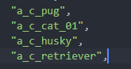

# 🐈⬛ ペットになった際のルール


前提: あくまでもネタ要素なため、一部の行動が制限されています。\
また本ルールはベータ版のため、変更される可能性がございます。\
ご了承ください。


～**基礎ルール～**\
・日本語で会話ができること。\
・マイクを使ってまたは /me を使って日本語でコミュニケーションがとれる事。

**～基本ルール～**\
**・**面的に強盗など猫ではできない行動は禁止です。\
・ペットとして飼われても大丈夫です。\
・語尾に猫であれば **`にゃ`**　などをつけると良い。\
**・**スマホを使用する行動は許される。\
・車については運転することは禁じられている。(助手席・後部座席に乗ることは可)\
・VIP車両は引き継がれない。\
・相手の許可がない限り猫の状態で攻撃する行為は禁止。

**～ペットの判定に入るもの～**\
**以下のリストのもの**\

<figure><figcaption></figcaption></figure>

以下のキャラクターは猫、犬でありこのルールが適用されます。
